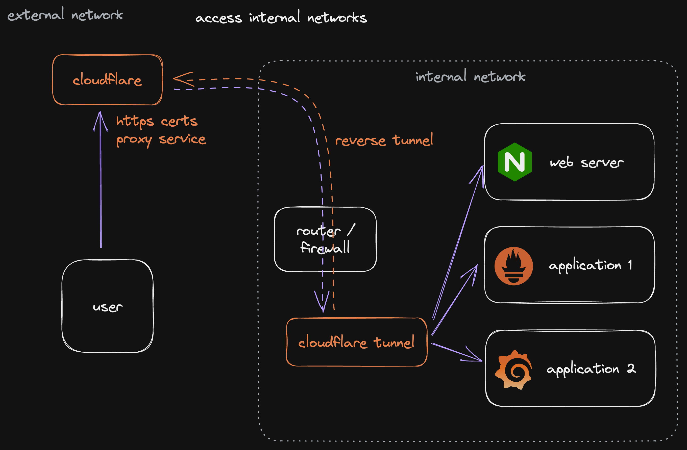
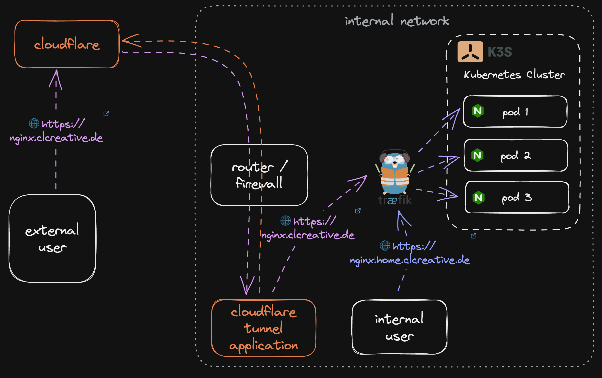

# How to use Cloudflare Tunnel in your Homelab (even with Traefik)

This is a tutorial on how to use Cloudflare Tunnels in a Homelab to make internal applications easily accessible on the public internet in a secure way. The video covers the benefits of using Cloudflare Tunnels for personal websites, homelab dashboards, or any web-based application that needs to be accessed from outside the network without complicated router configuration. And it also discusses the security of Cloudflare Tunnels and shares best practices for exposing administrative interfaces. #homelab #cloudflare #cloudflaretunnel

Video: https://youtu.be/yMmxw-DZ5Ec

---
## Security Considerations

When using Cloudflare Tunnels, it is important to be cautious about exposing administrative interfaces to the public internet. It is best to only expose services that you need to access from outside, and set up proper authentication with user access control.

It is also important to keep in mind that when you proxy your traffic through Cloudflare, they are terminating all your TLS connections, which means they can view all your traffic in plain text. This is a potential risk, even if it is a secured connection. To mitigate this risk, you can use authentication providers and other security measures.

---
## Prerequisites

• A Cloudflare Account (free to sign up)
• A public domain registered either directly in Cloudflare or with a different provider

---
## Add existing Domain to Cloudflare

Go to the Cloudflare Dashboard and select "Add Site". Enter your domain name and follow the instructions to change the name server addresses from the ones of your DNS provider to the addresses of the Cloudflare's name servers. Note that this process may take up to 24 hours.

---
## Deploy Cloudflare Tunnel

The Cloudflare Tunnel application will create a secure reverse tunnel from inside your homelab to the Cloudflare's infrastructure.



### Create new Cloudflare Tunnel

Go to the Zero Trust Dashboard and select "Set Up Cloudflare Tunnel". Give the tunnel a name and click "Next". Follow the instructions to install the Cloudflare Connector program in your network. This program will initialize a secured reverse tunnel from your internal environment to the Cloudflare's Servers. The Cloudflare Connector can be installed on Windows, MacOS, Linux, or a Docker Container. Once the program is installed, execute the command provided to make the tunnel active.


### Create Docker Compose file

Create a new project folder and create a new file called `docker-compose.yml` and add the following content:

```yaml
version: '3.9'

networks:
  frontend:
    external: true
  backend:
    external: true

services:
  cloudflaretunnel:
    container_name: cloudflaretunnel-demo-1
    image: cloudflare/cloudflared:2023.2.1
    restart: unless-stopped
    environment:
      - TUNNEL_TOKEN=$TUNNEL_TOKEN
    command: tunnel --no-autoupdate run
    networks:
      - frontend
      - backend
```

Load the tunnel token into the environment variable on your server by executing:

```sh
export TUNNEL_TUKEN=xxxxx
```

Start the container by executing the `docker-compose up -d`, and check the Cloudflare dashboard to see if the tunnel is healthy.

---
## Set up public hostname

1. Go to the Cloudflare Zero Trust Dashboard and edit the Cloudflare Tunnel application.
2. Go to the Public Hostnames section.
3. Add a subdomain for the application, such as  nginx-demo-one  on your public domain.
4. Enter the target URL for the application. If the application is using an HTTP protocol and is on the same docker network, you can use the container name as the URL.

---
## Fix Traefik issues

When using Cloudflare Tunnel with Traefik, you might encounter a problem with **404-errors**, when accessing your application. This is depending on the hostname request, which is using the public hostname, instead of the target hostname.

If you have this problem, change the Label for the Traefik Rule to add a double pipe for a logical or instruction. This will allow the request to match the internal hostname as well as the external hostname.

```
Host(`your-internal-hostname`) || Host(`your-public-hostname`)
```



---
## Setting Up Access Control for Nginx Web Server Services

This guide will walk you through the steps of setting up access control for Nginx web server services using Cloudflare Tunnel.

**Step 1: Open the Settings Menu**

Open the settings menu and head over to authentication. Here you can add multiple providers that offer well known implementations, such as Azure AD, GitHub, Google, SAML, or Okta. For this demonstration, we will pick the easiest one, which is the One time Pin authentication, that sends a short mail to you with a time based one time password.

**Step 2: Create an Application**

Create an application for all your subdomains with an asterisk, so that it will be active on every public hostname. Alternatively, you can create one application per service. Disable the application logo if you don't need it. Specify which authentication providers this application should support. In our case, we just have one, the TOTP PIN.

**Step 3: Create an Access Policy**

Create a new access policy and configure different rules that define which users should have access to this application. You can configure specific mail addresses, or you can add your public domain, so that everyone who can receive a mail under your public domain can access this application.


---
## References

- [Cloudflare Tunnel · Cloudflare Zero Trust docs](https://developers.cloudflare.com/cloudflare-one/connections/connect-apps/)