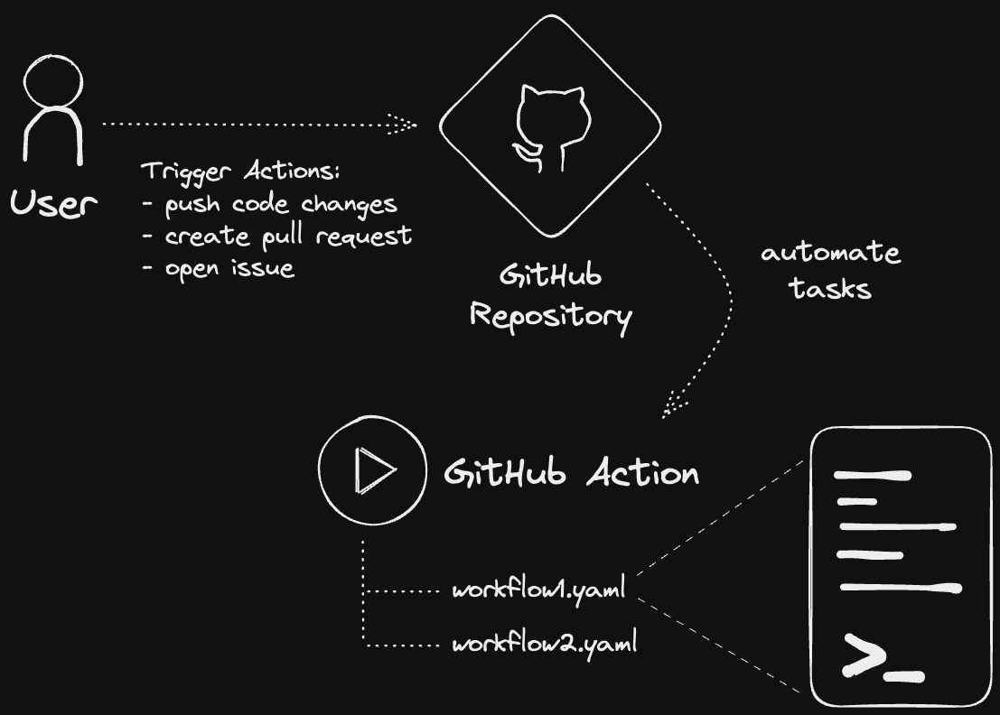
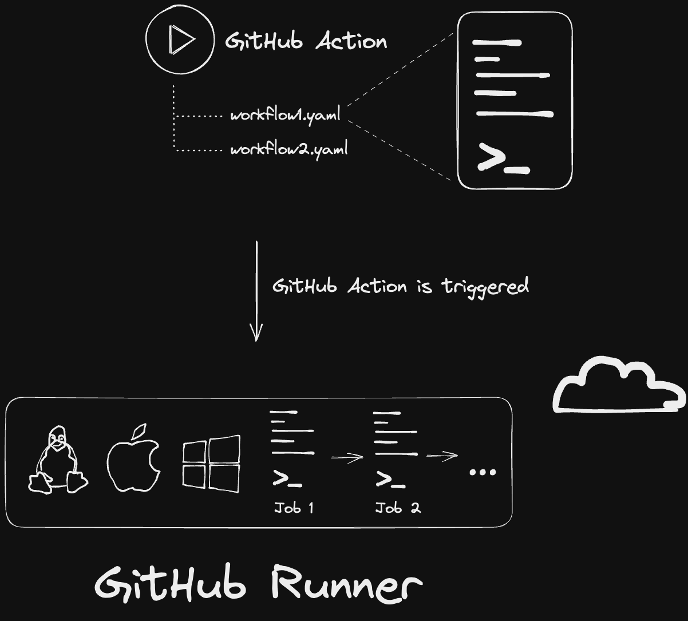
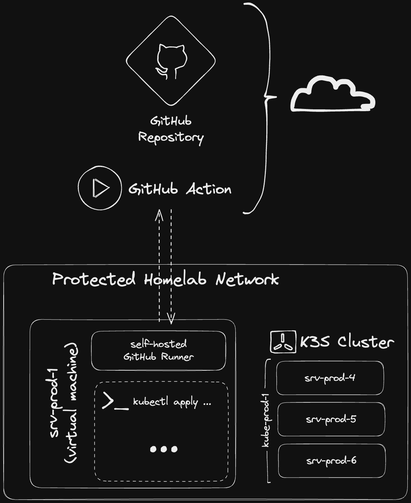
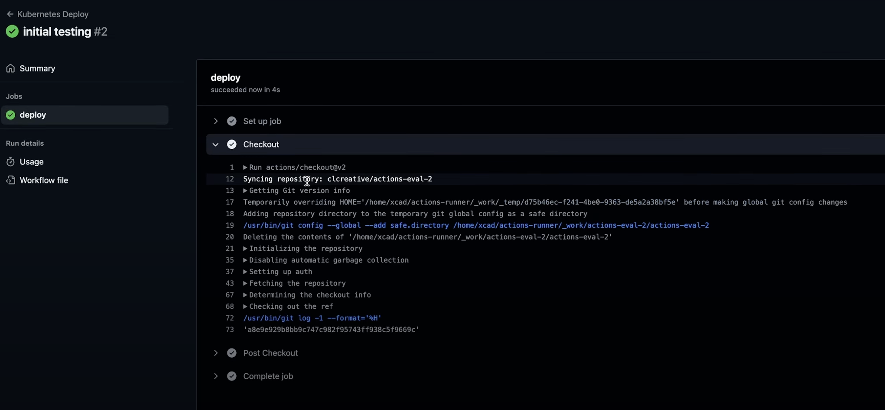
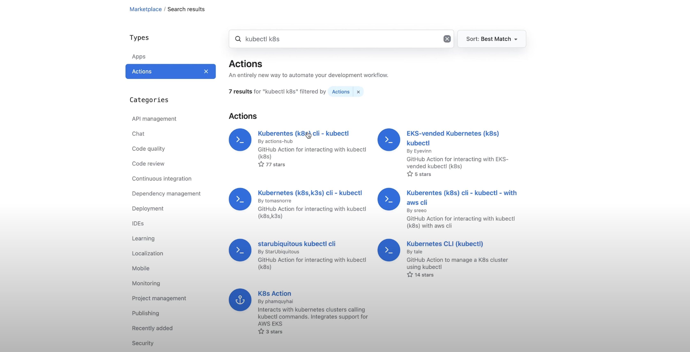
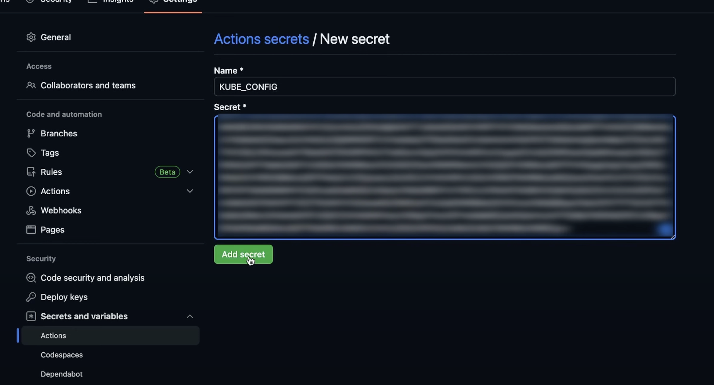

# Let's learn GitHub Actions, in a self-hosted Homelab!

Are you interested in automating your Homelab? Then learning GitHub Actions is a great way to get started! With GitHub Actions, you can automate the process of building, testing, and deploying applications on a Kubernetes Cluster. Instead of spending your day in front of a terminal, you can just sit back and let GitHub Actions do all the work for you. In this tutorial, I’ll show you how to set up a project, install a self-hosted runner, and deploy an app on your local Kubernetes Cluster. Tune in to learn more about Homelab automation with GitHub Actions! #GitHubActions #Homelab #Automation

Video: https://youtu.be/tIWDpG7sNTU

---
## Prerequisites

- Local Kubernetes Cluster
- GitHub Account
- Linux Server at Home

---
## What is GitHub Actions?

GitHub Actions is a powerful tool that can help automate tasks related to your GitHub repositories. Whether you’re developing code or defining infrastructure templates, GitHub Actions can help you automate tasks that need to be performed whenever you make changes to your repository.

To get started with GitHub Actions, you need to define workflows in YAML files inside your GitHub repository. These workflows can run one or more jobs, which are essentially a set of commands that are executed whenever a specific event occurs in your repository. These events can include actions like push code changes, create a pull request, or open an issue.



## What's the plan?

In this tutorial, we will learn how to automate the deployment of an Nginx webserver on a Kubernetes Demo Cluster using GitHub Actions. We will define a new workflow for a GitHub repository that contains an application template for the webserver.

**Example:**
```txt
actions-eval-2
└── kubernetes
    ├── deployment.yml
    ├── ingress.yml
    └── service.yml
```

This GitHub test repository contains three separate YAML files that define the manifests we want to apply to our cluster. These files include an application deployment, a service object, and an Ingress object.

Typically, we would clone the repository to our local machine and execute the Kubectl command on all three files to deploy the manifests on our cluster. However, we can automate this process using GitHub Actions. We can define a new workflow in the repository that triggers a new Kubectl Apply command whenever we make changes to the code and push them to GitHub. This way, the changes will automatically be applied to the cluster without us having to do it manually every time.

## Where do GitHub Actions run?

When using GitHub Actions, one question that might come up is where the actions run. Since we might need a computing instance with a specific environment to execute commands like Kubectl, we need to know where our workflows are being executed. GitHub spawns a new process on one of their cloud machines for every workflow that is triggered. These machines are called GitHub Runners and come in different types, such as Ubuntu Linux, Microsoft Windows, and macOS.



To get started with GitHub Actions, we don’t need to set up a server or install anything. All we need is a GitHub repository, and we can start defining our workflows in YAML files for free to be executed on one of GitHub’s cloud runners.

## Why use self-hosted Runners?

However, in a homelab situation, we usually have our own protected network where we’re hosting our services. If we want to execute workflows to apply manifests on our local cluster, we need to allow access from outside to our infrastructure so that the GitHub runners in the cloud can connect to it. While this is possible, it’s not the best solution. It’s better to run the actual commands and workflows inside our own environment using the same software that GitHub is running on their cloud and running it on one of our virtual Linux servers.



GitHub allows us to set up self-hosted runners for free, which is a better way to connect to any local environments, especially if we need to control access to internal resources. This also saves GitHub some cloud resources because they don’t need to compute the actual workloads. It’s a win-win situation for both GitHub and us.

## Set up an organization in GitHub

If you want to use it in your own infrastructure with a self-hosted runner, you will also need to create an organization, first.

1. Go to your GitHub Account under **Settings -> Access -> Organization**, and create a new organization.

2. Open the organization settings.

3. To create a new runner, go to **Code, planning, and automation -> Actions -> Runners**, and add a new self-hosted runner.


---
## Install GitHub Runner locally on Linux

Installing the Runner software on a Linux machine is a quick and easy process. Follow these steps to get started:

1. Download and extract the GitHub Runner code into your project folder.

```sh
curl -o actions-runner-osx-x64-2.303.0.tar.gz -L https://github.com/actions/runner/releases/download/v2.303.0/actions-runner-osx-x64-2.303.0.tar.gz

tar xzf ./actions-runner-osx-x64-2.303.0.tar.gz
```

2. Configure and Start the GitHub Runner.

```sh
./config.sh --url https://github.com/clcreative --token your-token

./run.sh
```

3. Install Runner as a service.

```shell
sudo ./svc.sh install

sudo ./svc.sh start
```

### Prepare the Runner

To execute certain workflows on the Runner, specific applications or libraries may need to be installed on the OS. For example, if a workflow automation includes command line tools such as Docker, Kubectl, Ansible, or Terraform, these must be installed on the Runner’s system. In this tutorial, Kubectl is used to deploy a webserver onto a Kubernetes cluster. The Runner will spawn a Docker Container with Kubectl built-in, and execute the commands inside this container. Once the workflow is completed, the container will be removed. Therefore, Kubectl does not need to be installed on the Runner’s VM, but Docker Engine and CLI must be installed.

On Ubuntu, you can follow these steps.

**Example:**
```sh
sudo apt install docker.io

sudo usermod -aG docker your-username

newgrp your-username
```

## Create a new project

Now that we have installed the necessary environment, we can finally start creating our project. We have set up a GitHub Account with an organization, configured the runner, and installed the right tools on it.

Let’s open the **Repository** and add a new GitHub Actions workflow.

1. Create a new `yml` file into the `.github/workflows` folder.

2. Specify the type of event such as `push`, `pull_request`, ..., that should trigger the GitHub Actions workflow.

3. Specify the branch, such as `main`, where this workflow should be executed. 

4. Create a new job `deploy`, that runs on the `self-hosted` Runner.

5. Add a `actions/checkout@v2` step, that will clone the Repositories code into the Runners temporary container filesystem.

**Example:**
```yml
name: Deploy to Kubernetes
on:
  push:
    branches:
      - main

jobs:
  deploy:
    runs-on: "self-hosted"  # (optional) name of the runner labels, groups
    steps:
      - name: Checkout code
        uses: actions/checkout@v2

	 # (...)
```

To do a quick test, just commit your changes to the Repository and push it. That should already execute the GitHub Actions workflow.



If you’re new to GitHub Actions, it’s a good idea to start by playing around with it in a test repository. Executing a few hello world commands is a great way to get familiar with how it works.

## Find GitHub Actions on the Marketplace

Once you’re comfortable with the basics, you can start to do something useful with it. For example, in this project, we want to deploy three Manifests to a Kubernetes Cluster. To do this, we need to add more steps to the job in our workflow, which will execute the kubectl apply command on the files.

Rather than writing shell commands to do this, we can use pre-defined environments for GitHub Actions that come with various tools installed, such as Kubectl. These environments can be found on GitHub Marketplace, and you can even create custom ones. It’s worth noting that these environments are mostly created by the community or the developers of the tools, so make sure to check who has created them before using them.

GitHub also maintains a repository called Actions Hub, which provides GitHub Actions environments for Docker, Kubectl, and a few other tools. The Kubectl environment in particular contains some useful additions to handle authentication properly, which is why we’re using it in this tutorial.



## Authenticate to the local Kubernetes Cluster

To authenticate to a Kubernetes Cluster, we need to provide credentials to the self-hosted Runner. We can securely store sensitive credentials that the Runners need in the GitHub Repository Settings.

1. Go to the Repository Settings, select “Actions”, and add a new Secret called “KUBE_CONFIG”. 

2. Copy your Kube Config file, converted to base64, and place it into the Secret.



## Use the Secret in the workflow

This environment variable will load the value from the GitHub Secret `KUBE_CONFIG`, and will be accessible to all jobs in the workflow, making it a great way to share data between jobs.

**Example:**
```yml
# (...)

env:
	KUBE_CONFIG: ${{ secrets.KUBE_CONFIG }}
	
# (...)
```

## Deploy a Kubernetes Application

Next, we can add our Kubectl Commands to deploy our Manifests. We will create three different steps for each of these files, using the environment from the actions hub, and the tool kubectl. The first step will run the Kubectl Command at the Deployment file, which will run the application. The second command will apply the Service object, and the third command will apply the Ingress Object.

1. Add your desired Kubernetes **Manifests** into the `kubernetes/` project folder.

2. Add new jobs to apply your **Manifests** via GitHub Actions.

**Examples:**
```yml

# (...)
      - name: Deploy App(Deployment)
        uses: actions-hub/kubectl@master
        with:
          args: apply -f kubernetes/deployment.yml
          
      - name: Deploy Service
        uses: actions-hub/kubectl@master
        with:
          args: apply -f kubernetes/service.yml
          
      - name: Deploy Ingress
        uses: actions-hub/kubectl@master
        with:
          args: apply -f kubernetes/ingress.yml

```

## Use Cases

I’m really excited about the possibilities this opens up for my homelab. I can use it to deploy my infrastructure with Terraform, automate the creation of virtual machines on Proxmox, or automate the deployment of all my homelab servers. I can also use it to run regular security checks on them.

I’m still figuring out the best way to use it in my homelab, but these are some ideas I’ve come up with. If you have any other ideas, let me know in the comments and I’ll show you some projects I’m working on with it in a few months.

## Watch the full Video

Video: https://youtu.be/tIWDpG7sNTU

---
## References

- [GitHub Actions Documentation - GitHub Docs](https://docs.github.com/en/actions)
